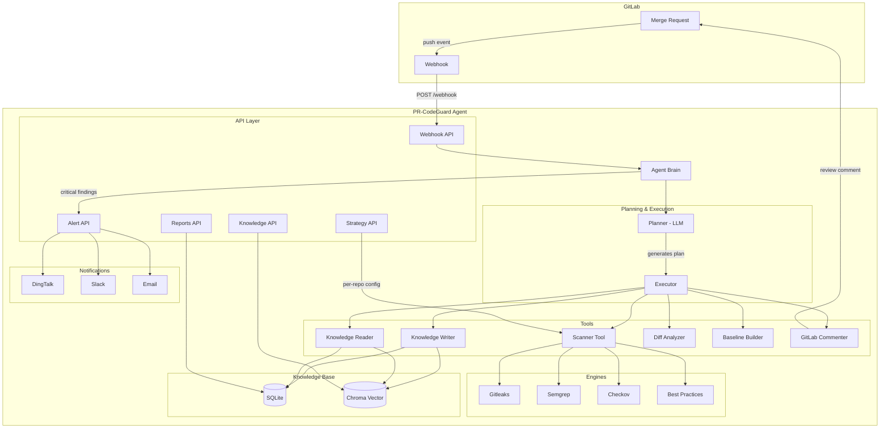

<p align="center">
  <picture>
    <source media="(prefers-color-scheme: dark)" srcset="https://trae-api-cn.mchost.guru/api/ide/v1/text_to_image?prompt=AI+code+review+agent+logo+with+shield+icon+and+robot+face+minimalist+design+tech+style+dark+background&image_size=landscape_16_9">
    <source media="(prefers-color-scheme: light)" srcset="https://trae-api-cn.mchost.guru/api/ide/v1/text_to_image?prompt=AI+code+review+agent+logo+with+shield+icon+and+robot+face+minimalist+design+tech+style+light+background&image_size=landscape_16_9">
    
  </picture>
</p>

<div align="center">

# 🔒 PR-CodeGuard Agent

**AI 驱动的智能代码审查 Agent — 让每一次 Merge Request 都经过专业安全审查**

[](https://python.org)
[](https://fastapi.tiangolo.com)
[](LICENSE)
[](CONTRIBUTING.md)
[](https://github.com/betteryanhy/codeguard-agent)

[English](README.md) · [中文](README_CN.md) · [报告 Bug](https://github.com/betteryanhy/codeguard-agent/issues) · [请求功能](https://github.com/betteryanhy/codeguard-agent/issues)

</div>

---

## 📋 目录

- [为什么选择 PR-CodeGuard Agent？](#-为什么选择-pr-codeguard-agent)
- [核心能力](#-核心能力)
- [架构](#-架构)
- [快速开始](#-快速开始)
- [屏幕截图](#-屏幕截图)
- [API 概览](#-api-概览)
- [配置参考](#-配置参考)
- [路线图](#-路线图)
- [贡献指南](#-贡献指南)
- [许可证](#-许可证)
- [联系我们](#-联系我们)

---

## 🎯 为什么选择 PR-CodeGuard Agent？

传统代码审查工具只是**被动扫描**——提交代码 → 跑规则 → 出报告。而 PR-CodeGuard Agent 是**主动决策**：

| 传统工具 | PR-CodeGuard Agent |
|---------|-------------------|
| 🚫 一次性扫描，结果孤立 | 🧠 **Agent Brain** 持续学习，每次扫描结果回写知识库 |
| 🚫 每个仓库同样的规则 | ⚙️ **按仓库自定义策略** —— 核心仓深度扫描，实验仓快速扫描 |
| 🚫 问题发现靠人翻报告 | 🤖 **自动评论 MR**，严重问题即时告警（钉钉/Slack/邮件） |
| 🚫 无法追溯历史 | 📖 **知识库记录**每次变更，支持语义搜索：“上个月谁改了 KMS 配置？” |
| 🚫 只看代码不关心业务 | 🔍 **Terraform 变更风险分析**，理解 IaC 语义，不仅仅是语法检查 |

**适合谁用？**
- 使用 **GitLab** 管理代码的团队
- 关注 **IaC (Terraform)** 安全的 DevOps/DevSecOps 团队
- 希望在 MR 流程中嵌入 **AI 代码审查**的工程团队
- 需要**量化开发者产出和代码质量趋势**的 Tech Lead

---

## ⚡ 核心能力

### 🔐 多引擎安全扫描

每次提交 MR 自动触发扫描管线，四个引擎并行检测：

| 引擎 | 检测内容 | 底层工具 | 策略级别 |
|------|---------|---------|---------|
| **密钥检测** | 硬编码密码、Token、私钥泄露 | Gitleaks | light / standard / deep |
| **SAST** | SQL 注入、凭证硬编码、代码缺陷 | Semgrep | standard / deep |
| **IaC 合规** | Terraform 安全反模式（公开 S3、KMS 缺失等） | Checkov | light / standard / deep |
| **最佳实践** | 自定义规则集（命名规范、资源标签等） | 内置规则引擎 | standard / deep |

每个仓库可独立配置扫描等级（light / standard / deep），精细控制扫描强度和覆盖范围。

### 🧠 AI Agent 决策大脑

不只是扫描器——是一个完整的 Agent 系统：

```
GitLab Webhook 事件到达
        ↓
┌───────────────────┐
│  Agent Brain      │  ← LLM 驱动的决策中心
│  ├─ Planner       │     分析事件 → 生成执行计划
│  ├─ Executor      │     调用工具 → 收集结果
│  └─ Knowledge IO  │     读写知识库 → 持续学习
└───────────────────┘
        ↓
  自动评论 MR + 告警通知
```

- **理解代码变更意图** — 不只看 diff，还理解"为什么改"
- **自适应执行** — 根据 MR 类型选择不同扫描策略
- **持续学习** — 每次扫描结果写入知识库，越用越聪明

### 📚 知识库系统

双重存储架构，让代码变更"有迹可循"：

```
                       ┌──────────────────────────┐
                       │  知识库                   │
                       │  ├─ SQLite (结构化)       │
                       │  │   ├─ 项目基线          │
                       │  │   ├─ MR 记录 & 提交    │
                       │  │   ├─ 文件变更明细      │
                       │  │   └─ 接口/模块关系     │
                       │  │                        │
                       │  └─ Chroma (向量)         │
                       │      ├─ 代码语义嵌入      │
                       │      └─ 自然语言搜索       │
                       └──────────────────────────┘
```

**典型场景：** "项目里哪些接口涉及数据库加密？" → 通过语义搜索直接定位到相关 MR 和代码片段。

### ⚙️ 按仓库自定义策略

不是"一刀切"的策略配置——每个仓库可以独立配置：

```json
// 核心基础设施仓库 → 深度扫描
{
  "scan_level": "deep",
  "engines_enabled": {"secrets": true, "sast": true, "iac": true, "best_practice": true},
  "risk_threshold": "medium",
  "ai_enabled": true
}

// 实验性功能仓库 → 轻量扫描
{
  "scan_level": "light",
  "engines_enabled": {"secrets": true, "sast": false, "iac": true, "best_practice": false},
  "risk_threshold": "critical",
  "branch_trigger": ["feature/*", "fix/*"]
}
```

### 📊 日报与趋势分析

聚合数据，让团队状态一目了然：

- **日报** — 每日合并 MR、代码行数、开发者贡献、安全问题统计
- **趋势** — 按周/月聚合，分析代码质量和安全风险变化趋势
- **邮件发送** — 配置 SMTP 后自动发送日报到指定邮箱

### 🚨 即时告警

严重安全问题自动推送到即时通讯工具：

- **钉钉机器人** — 支持签名校验
- **Slack Webhook** — 支持频道通知
- **邮件告警** — 通过 SMTP 发送
- **可配置阈值** — 按严重级别过滤，避免告警疲劳

### 🕸️ 自动发现与 Webhook 管理

- 启动时自动扫描 GitLab 上所有有权限的项目
- 批量注册 Webhook，监控 MR 事件
- 定时健康检查，发现断开自动重连

---

## 🏗 架构



---

## 🚀 快速开始

### 前提条件

- Python 3.10+
- GitLab 实例（Self-hosted 或 GitLab SaaS）
- GitLab Personal Access Token（`api` 权限）
- 可选：安装扫描工具以获得最佳效果

### 1 分钟安装

```bash
# 克隆仓库
git clone https://github.com/betteryanhy/codeguard-agent.git
cd codeguard-agent/pr-codeguard-agent

# 安装依赖
pip install -r requirements.txt

# 配置环境变量
cp .env.example .env
# 编辑 .env 填入你的 GitLab 配置
```

### 配置 `.env`

```env
# GitLab 连接
GITLAB_URL=http://your-gitlab-instance:80
GITLAB_API_TOKEN=your-personal-access-token
WEBHOOK_SECRET=choose-a-random-secret

# AI 功能（可选，开启后可获得 AI 增强评论）
AI_ENABLED=true
AI_API_KEY=your-deepseek-api-key
```

### 启动 Agent

```bash
python -m uvicorn app.main:app --host 0.0.0.0 --port 8082
```

首次启动会自动发现 GitLab 上所有你有权限的仓库，并注册 Webhook。不需要手动配置每个仓库！

### 验证运行

```bash
# 健康检查
curl http://localhost:8082/health

# 查看发现的仓库
curl http://localhost:8082/api/v1/discovery/projects

# 查看扫描策略
curl http://localhost:8082/api/v1/strategy/default | python -m json.tool
```

现在，提交一个 Merge Request → Agent 会自动扫描并在 MR 中评论结果 🎉

---

## 📸 屏幕截图

> 📌 *截图示例将在后续更新中添加。如果你使用了本项目，欢迎提交 PR 添加你的使用截图！*

| 功能 | 预览 |
|------|------|
| MR 自动评论 | *Agent 在 MR 中评论扫描结果* |
| 日报看板 | *日报邮件或 API 输出示例* |
| 知识库搜索 | *语义搜索结果示例* |

---

## 📡 API 概览

| 方法 | 路径 | 说明 |
|------|------|------|
| **系统** |||
| `GET` | `/health` | 健康检查 |
| `GET` | `/api/v1/config` | 系统配置信息 |
| **Webhook** |||
| `POST` | `/api/v1/webhook/gitlab` | GitLab Webhook 接收端点 |
| **扫描结果** |||
| `GET` | `/api/v1/tasks/` | 扫描任务列表 |
| `GET` | `/api/v1/results/{task_id}` | 扫描结果详情 |
| `GET` | `/api/v1/results/{task_id}/summary` | 扫描结果摘要 |
| **扫描策略** |||
| `GET` | `/api/v1/strategy/default` | 获取默认策略 |
| `PUT` | `/api/v1/strategy/default` | 更新默认策略 |
| `GET` | `/api/v1/strategy/repos` | 列出所有策略 |
| `GET` | `/api/v1/strategy/repos/{url}` | 获取仓库策略 |
| `PUT` | `/api/v1/strategy/repos/{url}` | 设置仓库策略 |
| `DELETE` | `/api/v1/strategy/repos/{url}` | 删除仓库策略 |
| **知识库** |||
| `GET` | `/api/v1/knowledge/search?q=` | 语义搜索知识库 |
| `GET` | `/api/v1/knowledge/mrs` | MR 知识记录列表 |
| `GET` | `/api/v1/knowledge/stats` | 知识库统计 |
| **日报 & 报告** |||
| `GET` | `/api/v1/reports/daily` | 日报数据 |
| `GET` | `/api/v1/reports/trends` | 趋势分析数据 |
| `POST` | `/api/v1/alerts/send-report` | 发送日报邮件 |
| **仓库发现** |||
| `GET` | `/api/v1/discovery/projects` | 已发现仓库列表 |
| `POST` | `/api/v1/discovery/scan` | 手动触发发现扫描 |
| `POST` | `/api/v1/discovery/register-webhooks` | 批量注册 Webhook |
| **告警系统** |||
| `GET` | `/api/v1/alerts/status` | 告警系统状态 |
| `POST` | `/api/v1/alerts/test` | 发送测试告警 |

---

## ⚙️ 配置参考

| 变量 | 默认值 | 说明 |
|------|--------|------|
| **GitLab 连接** |||
| `GITLAB_URL` | `http://gitlab:80` | GitLab 实例地址 |
| `GITLAB_API_TOKEN` | — | GitLab Personal Access Token（需 `api` 权限） |
| `WEBHOOK_SECRET` | — | Webhook 签名密钥 |
| **AI 引擎** |||
| `AI_ENABLED` | `false` | 启用 AI 代码审查 |
| `AI_API_KEY` | — | DeepSeek API Key |
| `AI_API_BASE` | `https://api.deepseek.com` | API 端点 |
| `AI_MODEL` | `deepseek-v4-flash` | AI 模型 |
| **扫描引擎** |||
| `ENGINES_SECRETS_ENABLED` | `true` | 密钥检测引擎 |
| `ENGINES_SAST_ENABLED` | `true` | SAST 引擎 |
| `ENGINES_IAC_ENABLED` | `true` | IaC 合规引擎 |
| `ENGINES_BEST_PRACTICE_ENABLED` | `true` | 最佳实践引擎 |
| **知识库** |||
| `KNOWLEDGE_ENABLED` | `true` | 启用知识库 |
| `KNOWLEDGE_DB_PATH` | `./data/knowledge.db` | SQLite 数据库路径 |
| `CHROMA_PERSIST_DIR` | `./data/chroma` | Chroma 向量存储路径 |
| **自动发现** |||
| `AUTO_DISCOVERY_ENABLED` | `true` | 启动时自动发现仓库 |
| **告警通知** |||
| `ALERT_ENABLED` | `true` | 启用告警系统 |
| `ALERT_SEVERITY_THRESHOLD` | `critical` | 告警阈值（info/minor/major/critical/blocker） |
| `ALERT_DINGTALK_WEBHOOK` | — | 钉钉机器人 URL |
| `ALERT_SLACK_WEBHOOK` | — | Slack Webhook URL |
| `ALERT_SMTP_HOST` | — | SMTP 服务器 |
| `ALERT_SMTP_PORT` | `587` | SMTP 端口 |
| `ALERT_SMTP_USER` | — | SMTP 用户名 |
| `ALERT_SMTP_PASSWORD` | — | SMTP 密码 |
| `ALERT_EMAIL_FROM` | — | 发件人地址 |
| `ALERT_EMAIL_TO` | — | 收件人地址（逗号分隔） |

---

## 🗺 路线图

- [x] 多引擎安全扫描（Gitleaks、Semgrep、Checkov）
- [x] GitLab Webhook 集成
- [x] 知识库系统（SQLite + Chroma）
- [x] AI Agent 决策大脑
- [x] 按仓库自定义扫描策略
- [x] 日报生成与邮件发送
- [x] 趋势分析
- [x] 即时告警（钉钉/Slack/邮件）
- [x] 自动仓库发现与 Webhook 管理
- [x] Terraform 变更风险分析
- [ ] Web 管理面板（Dashboard）
- [ ] GitHub 集成支持
- [ ] 自定义规则编辑器
- [ ] 多语言代码审查
- [ ] 与 Jira/飞书集成
- [ ] OpenAPI / Swagger UI 完善

---

## 🤝 贡献指南

我们欢迎所有形式的贡献——无论是报告 Bug、提交功能请求、改进文档还是提交代码！

1. Fork 本仓库
2. 创建特性分支：`git checkout -b feat/amazing-feature`
3. 提交改动：`git commit -m 'feat: add amazing feature'`
4. 推送分支：`git push origin feat/amazing-feature`
5. 提交 Pull Request

请确保：
- 代码风格通过 `flake8` 检查
- 测试通过：`pytest tests/ -v`
- 提交信息遵循 [Conventional Commits](https://www.conventionalcommits.org/) 规范

---

## 📄 许可证

本项目基于 MIT 许可证开源。详见 [LICENSE](LICENSE) 文件。

---

## 📬 联系我们

- **作者**: [@betteryanhy](https://github.com/betteryanhy)
- **项目地址**: [https://github.com/betteryanhy/codeguard-agent](https://github.com/betteryanhy/codeguard-agent)
- **Issues**: [报告问题](https://github.com/betteryanhy/codeguard-agent/issues)

---

<div align="center">

**如果你觉得这个项目有帮助，请给我们 ⭐️ 支持！**

你的 star 是我们持续改进的动力 🚀

</div>
